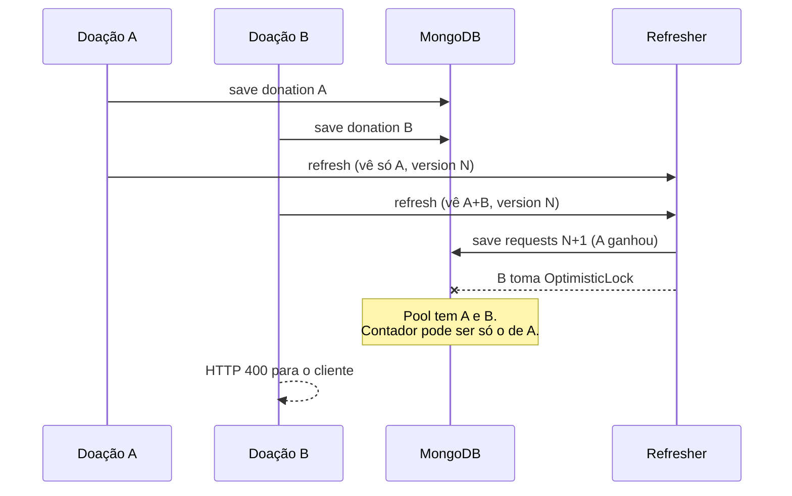
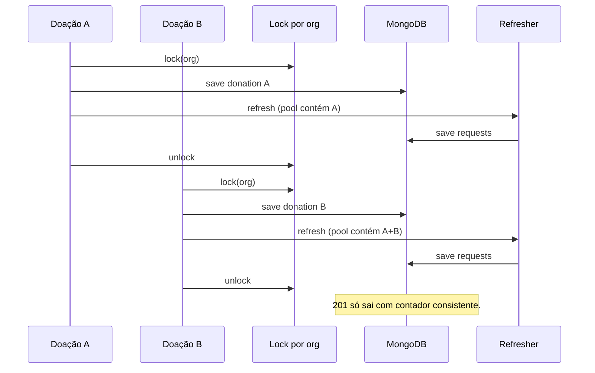

# Fulfillment: furos encontrados e estratégia de correção

Este documento registra o que a simulação de uso (`scripts/simulate-usage.py`) mediu, o que é **bug**, o que é **trade-off consciente**, a estratégia escolhida e **como foi resolvido** (§8).

Leia antes: [FULFILLMENT_STRATEGY.md](./FULFILLMENT_STRATEGY.md) (por que materializamos `fulfilledBloodBags` na escrita).

Evidência do furo: run `20260817045818rjcj` (`sim-report.json`), cenário `--scenario all`, API local.

---

## 1. O que a arquitetura promete hoje

O modelo de domínio **não liga doação → request**. Toda doação `COMPLETED` de um hemocentro entra num **pool** e o `DonationRequestFulfillmentService` distribui FIFO + ABO/Rh + janela de datas.

Para não recalcular isso em toda listagem:

- **Read path** só lê `fulfilledBloodBags` persistido.
- **Write path** recalcula o pool quando uma doação completa entra:
  - `CreateCompletedDonationUseCase`
  - `CompletePendingDonationUseCase`
  - ambos chamam `DonationRequestFulfillmentRefresher.refresh(organizationId, currentDate)`

Contrato implícito (e o que o cliente precisa):

> `201` / `200` de “doação completa” significa: a doação está no pool **e** os contadores daquele hemocentro foram reescritos.

A simulação mostrou que esse contrato **não vale sob concorrência**.

---

## 2. Furos encontrados

Classificação:

| Classe | Significado |
|---|---|
| **Bug** | Viola invariante ou o contrato HTTP. Precisa de correção agora. |
| **Trade-off** | Comportamento descrito em FULFILLMENT_STRATEGY.md §8. Não é surpresa; só vira trabalho se o produto exigir consistência imediata nesses eventos. |
| **Observação** | Sinal de custo / operação. Não é incorreto, mas limita escala. |

### 2.1 Bug — write path não é atômico (o furo principal)

Fluxo atual:

```text
1. donorRepository.save(donor)
2. donationRepository.save(donation)     ← pool já mudou
3. fulfillmentRefresher.refresh(...)
     load requests (@Version N)
     load completed donations
     synchronize (FIFO em memória)
     for each request: save              ← @Version N+1
```

Várias doações no **mesmo hemocentro** ao mesmo tempo:

1. Todas passam no passo 2 (doações gravadas).
2. Todas carregam requests na versão `N`.
3. A primeira que persistir as requests ganha (`N → N+1`).
4. As outras tomam `OptimisticLockingFailureException`.
5. O repositório vira isso em `IllegalStateException` → HTTP **400**.
6. A doação **já está no Mongo**. O cliente vê erro. O contador ficou o da última escrita que sobreviveu — em geral um recálculo com **pool incompleto**.

Isso é exatamente o `lost_refresh` da simulação.

Run `20260817045818rjcj`:

| Cenário | Doações HTTP ok | Refresh perdido | Lock visível no cliente |
|---|---|---|---|
| concurrency (12 paralelas, 1 hemocentro) | 12/12 | **11** | 0 (o script classificava o 400 depois do save como “refresh perdido”) |
| recurring onda 1 / 2 / 3 | 5/5 cada | **4** cada | idem |
| mixed-reads | 6/6 | **5** | idem |
| pending-complete | 1/12 HTTP 200 | o resto falhou **depois** de completar | retries viraram `"Only pending donations can be completed"` |
| isolation (sequencial, 2 hemocentros) | 5/5 | **0** | — |

Leitura: o algoritmo FIFO em si, no caso sequencial, se comporta. O furo é **concorrência no mesmo `organizationId`**.

Consequências concretas:

1. HTTP 400/erro com doação já persistida → cliente que retenta cria **outra** doação (`POST /donations/completed`) ou quebra no pending (`Only pending…`).
2. `fulfilledBloodBags` pode ficar **atrasado** até a próxima doação completa cujo refresh sobreviva.
3. O loop `for (request : requests) save` não é atômico: se a request 3 falhar, 1 e 2 já foram publicadas. Snapshot de leitura no meio disso poderia ser parcial (a simulação não viu overfill; viu distribuição errada).
4. Conflito otimista vira **400**, não **409**. O cliente não distingue “pedido inválido” de “tente de novo”.



### 2.2 Bug — complete de pending na mesma corrida

`CompletePendingDonationUseCase` faz o mesmo: `donation.complete()` + save + refresh.

Sob rajada:

- Um complete devolve 200 com refresh ok.
- Os outros já gravaram `COMPLETED` e falham no refresh.
- Retry de `PATCH /donations/complete` encontra estado não-pending → 400 `"Only pending donations can be completed"`.

A doação entrou no pool; o cliente não recebeu sucesso; o contador pode estar stale. Mesmo furo, outro endpoint.

### 2.3 Trade-off — stale até o próximo complete (já documentado)

A simulação **confirmou** o contrato da §8 de FULFILLMENT_STRATEGY.md. Não é regressão.

| Evento | Medido | Esperado? |
|---|---|---|
| Nova request num hemocentro com pool sobrando | nasceu `fulfilled=0` | Sim (`stale-on-create`) |
| Cancelar request | irmãs **não** mudaram na hora | Sim (`stale-on-cancel`) |
| `POST /donations/create-pending` | `fulfilled` continuou 0 | Sim (pendente não entra no pool) |

Isso só vira implementação **depois**, se o produto quiser consistência imediata nesses eventos: chamar o **mesmo** refresher no create/cancel/update de `goal`/`dateLimit`. Sem voltar a calcular na leitura.

### 2.4 Observação — custo do write path

Refresh é `O(doações históricas × requests ativas)` **daquele** hemocentro.

Run: mean onda 1 **2631 ms** → onda 3 **4566 ms** (Δ ≈ **1.9 s**) com o pool crescendo.

Não é bug de corretude. É o preço da materialização honesta (recalcular o FIFO, não dar `+1`). Fora do escopo agora. Se um hemocentro acumular milhares de doações, aí sim janela temporal / projeção incremental / job — prematuro hoje.

### 2.5 O que NÃO furou

- Isolamento entre hemocentros (pool A não preenche B).
- Invariante `fulfilled ≤ goal` (0 overfill nos snapshots).
- Flag `goalReached` alinhada com `fulfilled >= goal`.
- Read path sem 5xx no meio da escrita (`mixed-reads`).
- FIFO sequencial (isolation + testes de domínio).

O oráculo do script, na primeira execução, ordenava UUID como string. O Java usa `UUID.compareTo` (long **com sinal**: ids `8–f…` vêm antes de `0–7…`). Isso gerou falso positivo de “FIFO errado” quando a **soma** já batia. O script foi corrigido; não é furo do servidor.

---

## 3. Estratégias consideradas (e por que não)

A materialização na escrita **permanece**. Não voltamos a calcular o pool em toda recomendação/listagem.

| Candidato | Por que não agora |
|---|---|
| Recalcular sempre na leitura | Desfaz a otimização certa para o perfil do produto. |
| Só `fulfilled++` na “primeira request compatível” | Quebra redistribuição global (cancel, nova request, mudança de meta/prazo). |
| Job assíncrono / outbox | `201` voltaria a **não** garantir contador. Piora o contrato que a simulação quebrou. |
| Transação Mongo multi-documento | Exige replica set; acopla deploy; não resolve sozinho o “cliente retenta e duplica doação”. |
| Lock global da API | Castiga hemocentros que não compartilham pool. Isolation mostrou que A e B são independentes. |

---

## 4. Estratégia escolhida

Duas camadas no **mesmo write path**. A materialização continua; o que muda é **quando o HTTP de sucesso pode sair** e **como o refresh sobrevive a corrida**.

### Camada A — serializar por hemocentro (correção principal)

Um lock **por `organizationId`**, cobrindo o use case inteiro de doação completa:

```text
lock(organizationId):
    save donor
    save donation
    refresh()          # load + FIFO + save de todas as requests ativas
unlock
```

Efeito:

- No mesmo hemocentro, uma conclusão de cada vez.
- Hemocentros diferentes continuam em paralelo.
- O refresh sempre vê o pool **já incluindo** a doação que acabou de entrar.
- `@Version` deixa de colidir neste processo.
- `201` / `200` volta a significar: doação no pool **e** contadores consistentes.

Cabe no produto: completar doação é evento raro por hemocentro; recomendações/listagens (o caminho quente) não pegam o lock.

Implementação prevista: serviço de aplicação `OrganizationFulfillmentLock` (mapa de `ReentrantLock` por id, com `computeIfAbsent`). Usado só nos dois use cases de doação completa — não no read path.

Limite honesto: lock **in-process**. Uma instância do backend (Docker Compose / um processo) fica correta. Várias réplicas do backend no mesmo Mongo ainda podem colidir → camada B.

### Camada B — retry limitado no refresher (defesa)

Mesmo com lock local, o refresher precisa ser idempotente e tolerante:

1. Carrega requests ativas e doações completadas **de novo** a cada tentativa.
2. `synchronize` (FIFO completo, nunca `+1`).
3. Persiste **todas** as requests.
4. Se **qualquer** `save` tomar lock otimista: **não continua o loop**. Descarta o lote, recarrega, tenta de novo.
5. Teto curto (ex.: 8 tentativas, backoff curto). Se esgotar: `ConflictException` → HTTP **409**, mensagem estável.

Por que o retry relê doações: a camada A serializa *este* processo; outra réplica (ou um retry de cliente) pode ter gravado mais uma doação. Recalcular com o pool atual é o que o modelo já exige.

Por que 409 e não 400: 400 é validação (`dateLimit` no passado, etc.). 409 é “o estado mudou; o cliente **não** deve criar outra doação; pode reler requests”.

Mapeamento hoje: `OptimisticLockingFailureException` → `IllegalStateException` → 400. O refresher deve capturar o conflito e traduzir para `ConflictException` depois das retries — sem vazar `IllegalStateException` nesse caminho.

### O que o HTTP passa a garantir

| Situação | Resposta | Estado |
|---|---|---|
| Doação completa ok | 201 / 200 | Doação no pool + `fulfilledBloodBags` daquele hemocentro alinhado ao FIFO |
| Conflito esgotou retries (multi-réplica extrema) | 409 | Doação pode já existir; cliente relê, **não** cria de novo |
| Dados inválidos | 400 | Sem mudança de pool |

Pending: se o complete já persistiu e o refresh precisa de retry, o retry é **só do refresh**, não do `complete()`. Isso elimina o `"Only pending…"` espúrio.

### O que fica de fora desta leva (explícito)

- Chamar o refresher em create / cancel / update de request (stale consciente, §2.3).
- Janela histórica / recálculo incremental (custo, §2.4).
- Lock distribuído (Redis, Mongo `findAndModify` de lease) — só se houver mais de uma réplica de backend em produção e a camada B não bastar.
- Relógio da API (`dateRequested = LocalDate.now()`): a simulação não consegue viajar no tempo; não é o furo desta correção.

---

## 5. Onde o código muda

| Peça | Papel |
|---|---|
| `OrganizationFulfillmentLock` (novo, application) | `run(organizationId, Runnable)` serializa por hemocentro |
| `CreateCompletedDonationUseCase` | corpo do `execute` dentro do lock |
| `CompletePendingDonationUseCase` | idem |
| `DonationRequestFulfillmentRefresher` | retry + recarregar lote inteiro; conflito → `ConflictException` |
| `DonationRequestRepositoryImpl` | pode continuar lançando no save; o refresher trata |
| `RestExceptionHandler` | 409 já existe para `ConflictException`; passar a usá-lo neste conflito |
| Testes do refresher | retry recarrega e persiste; esgotamento vira conflito; falha no 2º save não deixa o lote “pela metade” sem retry |
| Teste de use case (se couber) | duas completes no mesmo org, uma após a outra no lock, ambas veem o pool crescente |

Read path **não muda**. FIFO em `DonationRequestFulfillmentService` **não muda**.

---

## 6. Como sabemos que fechou

Rodar de novo, API no ar:

```powershell
python scripts/simulate-usage.py --self-test
python scripts/simulate-usage.py --scenario all --report sim-report.json
```

Critério de pronto:

| Sinal | Antes (run citado) | Depois |
|---|---|---|
| `lost_refresh` em concurrency / ondas / mixed-reads | 11 / 4 / 5 | **0** |
| `lock_conflicts` visíveis no cliente nesses bursts | mascarados | **0** (serializado) ou só 409 se multi-réplica |
| FIFO após rajada vs oráculo | fail (e nudge) | **pass sem nudge** |
| pending-complete sucessos HTTP | 1/12 | **todos os completes válidos** |
| isolation | pass | **pass** |
| stale-on-create / stale-on-cancel | confirmados | **continuam** (ainda não estendemos o refresh) |
| overfill | 0 | **0** |

Se `lost_refresh` zerar e o FIFO ainda falhar: aí sim investigar o algoritmo, não o lock.

---

## 7. Ordem de implementação

1. Documentação do furo e da estratégia — feito.
2. `OrganizationFulfillmentLock` + envolver os dois use cases — feito (§8).
3. Retry no `DonationRequestFulfillmentRefresher` + 409 — feito (§8).
4. Testes unitários do refresher e do lock — feito.
5. Reexecutar `simulate-usage.py --scenario all` — feito. Veredito: run `20260817055229divh` (§8).

Não misturar nesta leva: refresh em create/cancel/update, nem otimização de complexidade do FIFO.

---

## 8. Como foi resolvido

Implementado no backend. A materialização na escrita **não mudou**; o que mudou é a **atomicidade percebida** do write path de doação completa.

### Camada A — `OrganizationFulfillmentLock`

Serviço singleton (`ConcurrentHashMap` + `ReentrantLock` por `organizationId`).

`CreateCompletedDonationUseCase` e `CompletePendingDonationUseCase` executam, **dentro do lock daquele hemocentro**:

1. persistir doador (última doação)
2. persistir a doação `COMPLETED`
3. `fulfillmentRefresher.refresh(...)`

Hemocentros diferentes não compartilham lock. O read path não passa por ele.

Arquivo: `application/usecase/donation/fulfillment/OrganizationFulfillmentLock.java`

### Camada B — retry no `DonationRequestFulfillmentRefresher`

Cada tentativa:

1. recarrega requests ativas e doações completadas
2. `synchronize` (FIFO completo)
3. persiste o lote
4. se **qualquer** `save` lançar conflito otimista (`IllegalStateException` com *changed by another operation*): **não continua o loop**; relê e tenta de novo
5. até 8 tentativas, backoff curto (50 ms × tentativa, teto 200 ms)
6. esgotou → `ConflictException` → HTTP **409**  
   `"Donation request was changed by another operation. Reload it and try again."`

O cliente **não** deve criar outra doação nesse 409; deve reler as requests. Falhas que não são lock otimista continuam subindo sem retry.

### Contrato HTTP depois da correção

```text
lock(organizationId):
    save donor
    save donation
    refresh (com retry de lote)
unlock
→ 201 / 200
```

| Situação | Resposta | Estado |
|---|---|---|
| Doação completa ok | 201 / 200 | Doação no pool + contadores daquele hemocentro alinhados ao FIFO |
| Conflito esgotou retries (multi-réplica extrema) | 409 | Doação pode já existir; reler, não criar de novo |
| Dados inválidos | 400 | Sem mudança de pool |



### O que a correção não cobre (ainda)

- Stale após create / cancel / update de request (§2.3) — de propósito.
- Custo `O(doações × requests)` (§2.4).
- Várias réplicas de backend: o lock é in-process; a camada B (retry + 409) é a defesa.

### Como verificar

```powershell
python scripts/simulate-usage.py --self-test
python scripts/simulate-usage.py --scenario all --report sim-report.json
```

Esperado após o deploy desta correção:

| Sinal | Antes (run `20260817045818rjcj`) | Depois |
|---|---|---|
| `lost_refresh` em concurrency / ondas / mixed-reads | 11 / 4 / 5 | **0** |
| FIFO após rajada vs oráculo | fail + nudge | **pass sem nudge** |
| pending-complete HTTP ok | 1/12 | **todos os completes válidos** |
| isolation | pass | **pass** |
| stale-on-create / stale-on-cancel | confirmados | **continuam** |

Testes de regressão: `DonationRequestFulfillmentRefresherTest` (retry, lote, 409) e `OrganizationFulfillmentLockTest` (serializa o mesmo org; paralela orgs diferentes).

### Veredito da simulação (run `20260817055229divh`)

Backend no ar com lock + `@Autowired` no construtor de produção. `fails=0`.

| Sinal | Run do furo `20260817045818rjcj` | Esta run |
|---|---|---|
| concurrency | 12/12 HTTP, **11** lock, **11** lost_refresh, FIFO fail | 12/12, **0** lock, **0** lost_refresh, FIFO pass sem nudge |
| recurring (3 ondas) | 4 lost_refresh por onda, FIFO fail | **0** lost_refresh, FIFO pass em todas |
| mixed-reads | 5 lost_refresh | 6/6 writes ok, 37/37 reads ok, 0 overfill |
| pending-complete | 1/12 HTTP 200 | **12/12**, FIFO pass |
| isolation | pass | pass |
| stale-on-create / stale-on-cancel | confirmados | **continuam** (contrato da materialização) |

O lock serializa o mesmo hemocentro, então a latência do burst **espalha**: o primeiro complete ~2 s, o último da fila ~28 s (p50 ~14 s). Isolation (sequencial, dois centros) permanece ~0.9 s. O Δ onda 1 → 3 (~4 s) continua sendo o `O(doações × requests)` do refresh, agora somado à fila do lock — custo aceito; não é regressão de corretude.

