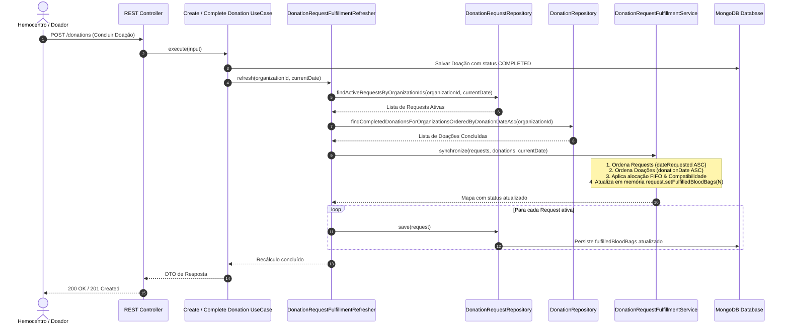

# Lógica de Preenchimento de Pedidos de Doação (`DonationRequest` Fulfillment)

Este documento descreve detalhadamente a regra de negócio, a arquitetura, o fluxo de dados e os componentes responsáveis pelo cálculo e preenchimento de bolsas de sangue nos pedidos de doação (`DonationRequest`) do **Blood Match**.

---

## 1. Visão Geral e Conceito Fundamental

No sistema, cada pedido de doação (`DonationRequest`) estabelece uma meta de bolsas de sangue necessárias (`goalBloodBags`) e rastreia quantas bolsas já foram atribuídas a ele (`fulfilledBloodBags`).

### O Conceito de Pool por Hemocentro (Sem Vínculo Direto 1:1)
Ao contrário de modelos onde o doador escolhe exatamente um pedido para doar no momento da doação:
1. **Não existe vínculo direto** chave-estrangeira doação → pedido.
2. Todas as doações completadas em um hemocentro compõem um **pool de doações** daquele hemocentro.
3. Esse pool é **distribuído dinamicamente** entre os pedidos de doação ativos do mesmo hemocentro.
4. O campo `fulfilledBloodBags` **não é um simples `COUNT` direto**, mas o resultado da simulação desse algoritmo de alocação/distribuição.

---

## 2. Regra de Negócio: Algoritmo FIFO + Compatibilidade

O motor de alocação é implementado em [DonationRequestFulfillmentService](file:///c:/Users/garde/Desktop/projects/blood-match/backend/src/main/java/bloodmatch/domain/services/DonationRequestFulfillmentService.java).

### Requisitos de Elegibilidade (`DonationRequest.acceptsDonation`)
Para que uma doação seja contabilizada para um determinado pedido de doação, ela precisa satisfazer **todas** as condições verificadas em [DonationRequest.java](file:///c:/Users/garde/Desktop/projects/blood-match/backend/src/main/java/bloodmatch/domain/donationrequest/DonationRequest.java#L328-L356):

1. **Mesmo Hemocentro**: A doação e o pedido pertencem à mesma organização/hemocentro (`organizationId`).
2. **Pedido Ativo**: O pedido deve estar marcado como `active = true`.
3. **Pedido Não Expirado**: A data atual da avaliação não pode ser superior à data limite do pedido (`currentDate <= dateLimit`).
4. **Doação Concluída**: Apenas doações com status `COMPLETED` participam da contagem.
5. **Janela Temporal da Doação**: A data da doação (`donationDate`) deve estar dentro do período de vigência do pedido:
   $$\text{dateRequested} \le \text{donationDate} \le \text{dateLimit}$$
6. **Compatibilidade Sanguínea**: O tipo sanguíneo do doador deve ser compatível com o tipo necessário pelo pedido (`donor.getBloodType().canDonateTo(bloodTypeNeeded)`).

### Regras de Compatibilidade Sanguínea (ABO e Rh)
A verificação é realizada por [BloodType.java](file:///c:/Users/garde/Desktop/projects/blood-match/backend/src/main/java/bloodmatch/domain/shared/valueObjects/BloodType.java#L45-L78):
- **O-**: Doador universal (compatível com todos os receptores).
- **O+**: Pode doar para `O+`, `A+`, `B+`, `AB+`.
- **A-**: Pode doar para `A-`, `A+`, `AB-`, `AB+`.
- **A+**: Pode doar para `A+`, `AB+`.
- **B-**: Pode doar para `B-`, `B+`, `AB-`, `AB+`.
- **B+**: Pode doar para `B+`, `AB+`.
- **AB-**: Pode doar para `AB-`, `AB+`.
- **AB+**: Pode doar apenas para `AB+`.

### Algoritmo de Distribuição FIFO (First-In, First-Out)
O cálculo funciona da seguinte maneira:

1. **Ordenação de Pedidos**: Todos os pedidos ativos do hemocentro são ordenados por data de criação (`dateRequested` ASC) e, em caso de empate, por ID (`id` ASC). Pedidos mais antigos têm prioridade.
2. **Ordenação de Doações**: Todas as doações concluídas do hemocentro são ordenadas pela data da doação (`donationDate` ASC) e ID (`id` ASC).
3. **Encaixe FIFO**:
   - Para cada doação no pool (da mais antiga para a mais recente):
   - Percorre a lista de pedidos ordenados do hemocentro.
   - Encontra o **primeiro pedido** que aceita a doação (`acceptsDonation`) e que **ainda não atingiu sua meta** (`fulfilled < goalBloodBags`).
   - Aloca 1 bolsa a esse pedido (`fulfilled + 1`).
   - Passa para a próxima doação. (Cada doação completa aloca no máximo 1 bolsa para 1 pedido).

---

## 3. Arquitetura de Performance: Materialização na Escrita (Write Path)

### Abordagem Escolhida: Contador Denormalizado / Materializado
- **Read Path (Leitura Frequente)**: Consultas de recomendações de doação ou listagem de pedidos **NÃO** recalculam o pool. Elas apenas leem o valor do campo persistido `fulfilledBloodBags` no documento MongoDB (`DonationRequestSchema`).
- **Write Path (Escrita)**: O cálculo do pool é executado e persistido no banco **somente quando eventos alteram o pool de doações completadas**.

### Triggers de Atualização do Contador
O recálculo é coordenado pela classe [DonationRequestFulfillmentRefresher](file:///c:/Users/garde/Desktop/projects/blood-match/backend/src/main/java/bloodmatch/application/usecase/donation/fulfillment/DonationRequestFulfillmentRefresher.java).

Atualmente, é disparado em **dois casos de uso**:
1. [CreateCompletedDonationUseCase](file:///c:/Users/garde/Desktop/projects/blood-match/backend/src/main/java/bloodmatch/application/usecase/donation/createcompleted/CreateCompletedDonationUseCase.java): Registro direto de uma nova doação concluída.
2. [CompletePendingDonationUseCase](file:///c:/Users/garde/Desktop/projects/blood-match/backend/src/main/java/bloodmatch/application/usecase/donation/completependingdonation/CompletePendingDonationUseCase.java): Conclusão de uma doação previamente pendente/agendada.

### O que NÃO Dispara Recálculo
- Criar doação com status pendente.
- Criar novo pedido de doação (inicia em `fulfilledBloodBags = 0`).
- Consultar a API de recomendações ou pedidos por usuário.

---

## 4. Fluxo Completo de Execução

### Fluxograma do Processamento de Preenchimento (Write Path)

---

## 5. Mapeamento dos Arquivos e Responsabilidades

| Papel | Arquivo | Responsabilidade |
|---|---|---|
| **Algoritmo Core (FIFO)** | [DonationRequestFulfillmentService.java](file:///c:/Users/garde/Desktop/projects/blood-match/backend/src/main/java/bloodmatch/domain/services/DonationRequestFulfillmentService.java) | Ordena pedidos e doações e realiza a distribuição em memória. |
| **Coordenador do Write Path** | [DonationRequestFulfillmentRefresher.java](file:///c:/Users/garde/Desktop/projects/blood-match/backend/src/main/java/bloodmatch/application/usecase/donation/fulfillment/DonationRequestFulfillmentRefresher.java) | Busca dados do banco por hemocentro, invoca o serviço de sincronização e persiste as alterações. |
| **Regras de Aceite do Pedido** | [DonationRequest.java](file:///c:/Users/garde/Desktop/projects/blood-match/backend/src/main/java/bloodmatch/domain/donationrequest/DonationRequest.java) | Define a lógica de `acceptsDonation()` e guarda o estado do pedido. |
| **Compatibilidade Sanguínea** | [BloodType.java](file:///c:/Users/garde/Desktop/projects/blood-match/backend/src/main/java/bloodmatch/domain/shared/valueObjects/BloodType.java) | Valida a matriz de doação/recepção de tipos sanguíneos. |
| **Persistência MongoDB** | [DonationRequestSchema.java](file:///c:/Users/garde/Desktop/projects/blood-match/backend/src/main/java/bloodmatch/infra/persistence/schema/DonationRequestSchema.java) | Mapeia o campo `fulfilledBloodBags` no banco de dados. |
| **Trigger Write Path 1** | [CreateCompletedDonationUseCase.java](file:///c:/Users/garde/Desktop/projects/blood-match/backend/src/main/java/bloodmatch/application/usecase/donation/createcompleted/CreateCompletedDonationUseCase.java) | Processa criação de doação concluída e aciona o refresher. |
| **Trigger Write Path 2** | [CompletePendingDonationUseCase.java](file:///c:/Users/garde/Desktop/projects/blood-match/backend/src/main/java/bloodmatch/application/usecase/donation/completependingdonation/CompletePendingDonationUseCase.java) | Processa transição de doação pendente para concluída e aciona o refresher. |

---

## 6. Exemplo Prático de Preenchimento

Considere o **Hemocentro Central** com os seguintes pedidos ativos:
- **R1**: Solicitado em `10/01`, Necessita `A+`, Meta: `2` bolsas.
- **R2**: Solicitado em `12/01`, Necessita `O+`, Meta: `1` bolsa.

Recebimento de doações no pool do **Hemocentro Central**:
- **D1**: Realizada em `11/01`, Doador `O-` (Compatível com `A+` e `O+`).
- **D2**: Realizada em `13/01`, Doador `A+` (Compatível com `A+`).
- **D3**: Realizada em `14/01`, Doador `O+` (Compatível com `O+`).

### Passo a Passo da Distribuição FIFO:
1. **Processando D1 (`O-`)**:
   - Avalia **R1** (mais antiga): `O-` pode doar para `A+`? **Sim**. R1 aceita a doação. R1 passa a ter `fulfilled = 1`. (D1 consumida).
2. **Processando D2 (`A+`)**:
   - Avalia **R1**: `A+` pode doar para `A+`? **Sim**. R1 aceita a doação. R1 atinge a meta (`fulfilled = 2`). (D2 consumida).
3. **Processando D3 (`O+`)**:
   - Avalia **R1**: Meta de R1 já foi atingida (`2/2`). Pula R1.
   - Avalia **R2**: `O+` pode doar para `O+`? **Sim**. R2 aceita a doação. R2 passa a ter `fulfilled = 1`. (D3 consumida).

**Resultado Final Materializado**:
- `R1`: `fulfilledBloodBags = 2` (Meta Atingida)
- `R2`: `fulfilledBloodBags = 1` (Meta Atingida)
